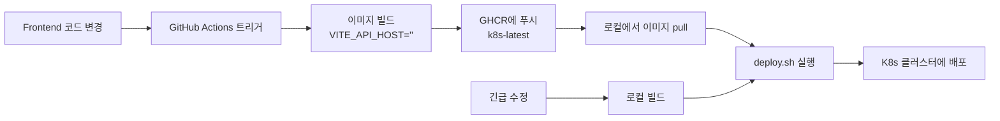

# GitHub Actions로 K8s UI 이미지 빌드 및 배포 가이드

## 환경 구성

- **GitHub Actions**: 이미지 빌드 및 GHCR 푸시
- **K8s 클러스터**: Private on-premises 환경
- **배포 방법**: 로컬에서 `deploy.sh` 스크립트 실행

## 빌드 방법

### 옵션 1: GitHub Actions 사용 (권장)

1. **워크플로우 트리거**
   ```bash
   # GitHub 웹 인터페이스에서:
   # 1. Actions 탭으로 이동
   # 2. "Build UI for Kubernetes" 선택
   # 3. "Run workflow" 클릭
   # 4. 브랜치: main, 이미지 태그: k8s-latest (기본값)
   ```

   또는 GitHub CLI 사용:
   ```bash
   gh workflow run build-ui-for-k8s.yml \
     --ref main \
     --field image_tag=k8s-latest
   ```

2. **빌드 완료 대기** (약 5-10분)
   - GitHub Actions 페이지에서 진행 상황 확인
   - 성공 시 `ghcr.io/jc01rho/skald-ui:k8s-latest` 이미지 생성됨

3. **로컬에서 배포**
   ```bash
   cd /home/sparrow/git/skald/k8s
   
   # 이미지가 공개되어 있으면 바로 배포
   IMAGE_TAG=k8s-latest ./deploy.sh
   
   # 또는 이미지를 먼저 pull (private인 경우)
   docker login ghcr.io
   docker pull ghcr.io/jc01rho/skald-ui:k8s-latest
   IMAGE_TAG=k8s-latest ./deploy.sh
   ```

### 옵션 2: 로컬 빌드 및 배포

Private 레지스트리를 사용하거나 즉시 빌드가 필요한 경우:

```bash
cd /home/sparrow/git/skald

# 1. 로컬에서 빌드
./k8s/build-ui-for-k8s.sh

# 2. (선택) 로컬 레지스트리에 푸시
docker tag ghcr.io/jc01rho/skald-ui:k8s-proxy localhost:5000/skald-ui:k8s-proxy
docker push localhost:5000/skald-ui:k8s-proxy

# 3. 배포
cd k8s
IMAGE_TAG=k8s-proxy ./deploy.sh
```

## ui-deployment.yaml 이미지 태그 업데이트

배포 전에 올바른 이미지 태그를 사용하도록 설정:

```bash
# 임시 방법 (환경 변수)
export IMAGE_TAG=k8s-latest
cd k8s
./deploy.sh

# 또는 파일 직접 수정
# k8s/ui-deployment.yaml 43번째 줄:
# image: ghcr.io/jc01rho/skald-ui:k8s-latest
```

## 검증

### 1. 이미지가 올바르게 빌드되었는지 확인

```bash
# GitHub Actions에서 빌드한 경우
docker pull ghcr.io/jc01rho/skald-ui:k8s-latest
docker run --rm ghcr.io/jc01rho/skald-ui:k8s-latest \
  find /usr/share/nginx/html -name "*.js" -exec grep -l "localhost:8080" {} \;

# 결과가 없으면 성공
```

### 2. K8s 배포 후 확인

```bash
# Pod 상태 확인
kubectl get pods -n skald -l component=ui

# 환경 변수 확인
kubectl exec -it deployment/ui -n skald -- env | grep VITE_API_URL
# 예상: VITE_API_URL=/api

# Nginx 프록시 테스트
kubectl exec -it deployment/ui -n skald -- \
  curl -s -o /dev/null -w "%{http_code}" http://localhost/api/health
# 예상: 200
```

### 3. 브라우저 테스트

1. https://ui.skald.sparrow.local 접속
2. 개발자 도구 (F12) → Network 탭
3. 로그인 또는 API 호출 발생시키기
4. 요청 URL 확인:
   - ✅ `https://ui.skald.sparrow.local/api/...`
   - ❌ `http://localhost:8080/api/...`

## 트러블슈팅

### GitHub Actions 빌드 실패

```bash
# 로그 확인
gh run list --workflow=build-ui-for-k8s.yml
gh run view <run-id> --log
```

### 이미지 pull 실패 (private 레지스트리)

```bash
# GitHub Container Registry 로그인
echo $GITHUB_TOKEN | docker login ghcr.io -u USERNAME --password-stdin

# 또는 Personal Access Token 사용
docker login ghcr.io
```

### Pod가 여전히 localhost:8080으로 요청

**원인**: 잘못된 이미지 사용

**해결**:
```bash
# 현재 사용 중인 이미지 확인
kubectl get deployment ui -n skald -o jsonpath='{.spec.template.spec.containers[0].image}'

# k8s-latest가 아니면 수정
kubectl set image deployment/ui -n skald \
  ui=ghcr.io/jc01rho/skald-ui:k8s-latest

# Pod 재시작
kubectl rollout restart deployment/ui -n skald
```

## 요약



## 다음 단계

1. GitHub Actions에서 "Build UI for Kubernetes" 워크플로우 실행
2. 빌드 완료 대기
3. 로컬에서 `IMAGE_TAG=k8s-latest ./deploy.sh` 실행
4. 브라우저에서 테스트
