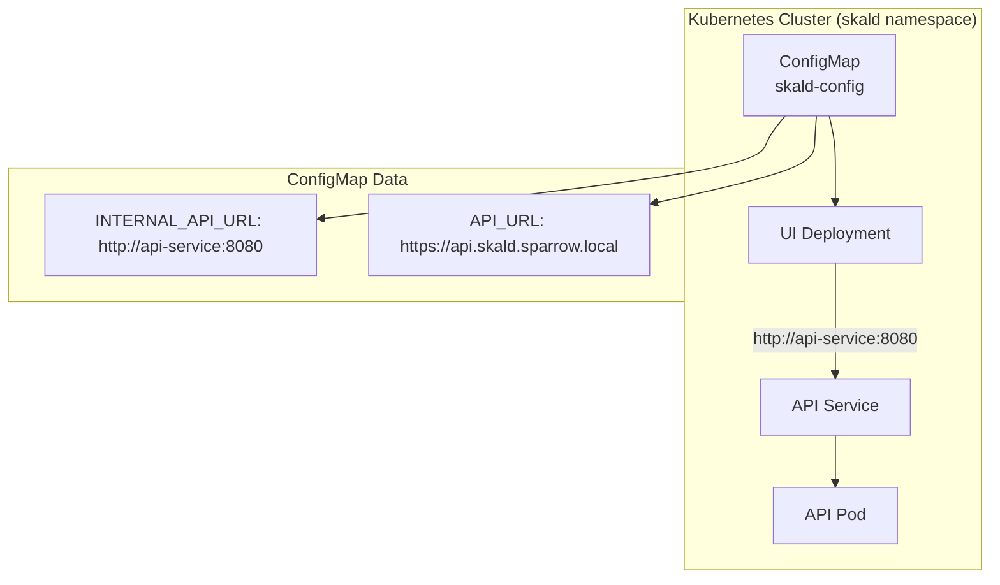

# Kubernetes 환경에서 동적 API URL 설정 아키텍처 설계

## 문제 정의

현재 시스템에서 UI가 API 서버에 연결할 때 `http://localhost:8080`을 하드코딩하여 사용하고 있어 Kubernetes 환경에서 문제가 발생하고 있습니다. 이 문제를 해결하기 위해 UI가 API 서버의 주소를 동적으로 설정할 수 있는 아키텍처를 설계합니다.

## 현재 시스템 분석

### 현재 API URL 설정 방식

1. **프론트엔드 코드**: `frontend/src/lib/api.ts`에서 `VITE_API_HOST` 환경 변수를 사용하여 API URL을 설정
   ```typescript
   const LOCAL_URL = 'http://localhost:3000'
   export const domain = import.meta.env.VITE_API_HOST || LOCAL_URL
   ```

2. **UI Deployment**: `k8s/ui-deployment.yaml`에서 `VITE_API_URL`이 하드코딩됨
   ```yaml
   env:
   - name: VITE_API_URL
     value: "https://api.skald.sparrow.local"
   ```

3. **ConfigMap**: `k8s/configmap.yaml`에 외부 접속용 API_URL이 이미 설정됨
   ```yaml
   API_URL: "https://api.skald.sparrow.local"
   ```

4. **API Service**: `k8s/api-service.yaml`에서 ClusterIP 서비스로 정의됨
   ```yaml
   metadata:
     name: api-service
   spec:
     type: ClusterIP
     ports:
     - port: 8080
       targetPort: 8080
   ```

### 문제점

1. UI 컨테이너가 API 서비스를 찾지 못해 통신 실패
2. 하드코딩된 URL로 인해 환경 변경 시 재배포 필요
3. Kubernetes의 서비스 디스커버리 원칙을 따르지 않음

## 해결 방안 설계 (수정됨 - 2025-12-03)

### 문제 원인 재분석

기존 설계의 문제점:
1. **Vite 빌드 시점 환경 변수 제약**: Vite는 빌드 시점에 환경 변수를 코드에 삽입하므로, 런타임에 환경 변수를 변경해도 적용되지 않음
2. **브라우저 실행 환경**: UI는 사용자의 브라우저에서 실행되므로 클러스터 내부 주소(`http://api-service:8080`)에 접근 불가능
3. **CORS 문제**: 다른 도메인/포트로 API를 호출하면 CORS 정책으로 인해 차단될 수 있음

### 최종 해결 방안: Nginx 프록시 방식

**핵심 아이디어**: UI와 API를 동일 오리진에서 제공하고, Nginx가 `/api` 경로의 요청을 클러스터 내부 API 서비스로 프록시

#### 1. Nginx 설정 ConfigMap 생성

**새로 생성할 파일**: `k8s/ui-nginx-configmap.yaml`

```yaml
apiVersion: v1
kind: ConfigMap
metadata:
  name: ui-nginx-config
  namespace: skald
data:
  nginx.conf: |
    # ... (전체 설정은 파일 참조)
    location /api/ {
      proxy_pass http://api-service:8080/api/;
      # 프록시 헤더 설정
      proxy_set_header Host $host;
      proxy_set_header X-Real-IP $remote_addr;
      proxy_set_header X-Forwarded-For $proxy_add_x_forwarded_for;
      proxy_set_header X-Forwarded-Proto $scheme;
    }
```

#### 2. UI Deployment 수정

**수정할 파일**: `k8s/ui-deployment.yaml`

```yaml
env:
# 상대 경로로 API 호출 - Nginx가 프록시
- name: VITE_API_URL
  value: "/api"

# Nginx 설정 마운트
volumeMounts:
- name: nginx-config
  mountPath: /etc/nginx/nginx.conf
  subPath: nginx.conf
  readOnly: true

volumes:
- name: nginx-config
  configMap:
    name: ui-nginx-config
```

#### 3. 프론트엔드 코드 확인

**파일**: `frontend/src/lib/api.ts`

```typescript
// VITE_API_URL이 "/api"로 설정되므로 상대 경로로 요청
export const domain = import.meta.env.VITE_API_URL || 'http://localhost:8080'
```

### 아키텍처 흐름

```
[브라우저] 
  ↓ https://ui.skald.sparrow.local/api/user/details
  ↓
[Ingress (NGINX)]
  ↓ 라우팅: ui.skald.sparrow.local → ui-service:80
  ↓
[UI Pod - Nginx]
  ↓ 프록시: /api/* → http://api-service:8080/api/*
  ↓
[API Service]
  ↓
[API Pod]
```

## Kubernetes 서비스 디스커버리 통합

### 서비스 디스커버리 원칙

1. **서비스 이름**: Kubernetes DNS를 사용하여 `api-service` 이름으로 API 서버에 접근
2. **네임스페이스**: 동일 네임스페이스(`skald`) 내에서는 서비스 이름만으로 접근 가능
3. **포트**: 서비스에서 정의된 포트(8080)를 사용하여 통신

### 통합 아키텍처



## 전체 시스템 아키텍처 통합

### 데이터 흐름

1. **빌드 시점**: 프론트엔드 코드가 `import.meta.env.VITE_API_URL`을 참조하도록 빌드
2. **배포 시점**: UI Deployment가 ConfigMap에서 INTERNAL_API_URL 값을 읽어 VITE_API_URL 환경 변수로 설정
3. **런타임**: 프론트엔드 애플리케이션이 환경 변수를 통해 API 서비스에 접근

### 환경별 설정

| 환경 | INTERNAL_API_URL | API_URL | 용도 |
|------|------------------|---------|------|
| Development | `http://api-service:8080` | `http://localhost:8080` | 로컬 개발 |
| Staging | `http://api-service:8080` | `https://staging-api.example.com` | 스테이징 |
| Production | `http://api-service:8080` | `https://api.skald.sparrow.local` | 운영 |

## 구현 단계 (수정됨 - 2025-12-03)

### 1단계: Nginx ConfigMap 생성
1. `k8s/ui-nginx-configmap.yaml` 파일 확인 (이미 생성됨)
2. ConfigMap 배포:
   ```bash
   kubectl apply -f k8s/ui-nginx-configmap.yaml
   ```

### 2단계: UI Deployment 수정 및 배포
1. `k8s/ui-deployment.yaml` 수정 사항 확인 (이미 수정됨):
   - `VITE_API_URL` 환경 변수를 `/api`로 설정
   - Nginx 설정 볼륨 마운트 추가
2. UI Deployment 재배포:
   ```bash
   kubectl apply -f k8s/ui-deployment.yaml
   kubectl rollout restart deployment/ui -n skald
   ```

### 3단계: 배포 확인
1. Pod 재시작 확인:
   ```bash
   kubectl get pods -n skald -l component=ui -w
   ```
2. Nginx 설정 확인:
   ```bash
   kubectl exec -it deployment/ui -n skald -- cat /etc/nginx/nginx.conf
   ```
3. 환경 변수 확인:
   ```bash
   kubectl exec -it deployment/ui -n skald -- env | grep VITE_API_URL
   ```


## 검증 방법 (수정됨 - 2025-12-03)

### 1. UI Nginx ConfigMap 확인
```bash
kubectl get configmap ui-nginx-config -n skald -o yaml
```

### 2. UI Pod 환경 변수 확인
```bash
kubectl exec -it deployment/ui -n skald -- env | grep VITE_API_URL
# 예상 출력: VITE_API_URL=/api
```

### 3. Nginx 프록시 동작 확인
```bash
# UI Pod 내부에서 API 프록시 테스트
kubectl exec -it deployment/ui -n skald -- curl -v http://localhost:80/api/health

# 또는 로컬 포트 포워딩으로 테스트
kubectl port-forward -n skald svc/ui-service 8081:80
# 브라우저나 curl로 http://localhost:8081/api/health 접속
```

### 4. 브라우저에서 실제 API 호출 확인
1. 브라우저에서 `https://ui.skald.sparrow.local` 접속
2. 개발자 도구(F12) → Network 탭 열기
3. API 요청이 `/api/...` 경로로 발생하는지 확인
4. 응답 헤더에서 X-Forwarded-For 등 프록시 헤더 확인

## 장점 (수정됨 - 2025-12-03)

1. **동일 오리진 정책 준수**: UI와 API가 동일한 오리진에서 제공되므로 CORS 문제 완전 해결
2. **Vite 빌드 제약 극복**: 런타임 환경 변수가 아닌 Nginx 프록시를 사용하여 빌드 시점 제약 우회
3. **브라우저 호환성**: 브라우저에서 클러스터 내부 주소에 접근할 필요 없음
4. **보안 강화**: API 서비스가 클러스터 내부에만 노출되고 Ingress를 통해서만 접근 가능
5. **유지보수성**: Nginx 설정만 변경하면 API 라우팅 수정 가능 (프론트엔드 재빌드 불필요)
6. **성능**: 동일 도메인에서 HTTP/2 연결 재사용 가능

## 고려사항 (수정됨 - 2025-12-03)

1. **Nginx 설정 관리**: ConfigMap 변경 시 Pod 재시작 필요
2. **프록시 헤더**: X-Forwarded-* 헤더가 올바르게 전달되는지 확인
3. **타임아웃**: 긴 API 호출에 대한 프록시 타임아웃 설정 필요시 조정
4. **로깅**: Nginx 로그와 API 로그를 함께 모니터링하여 프록시 상태 확인

## 결론 (수정됨 - 2025-12-03)

Nginx 프록시 방식을 사용하여 다음 문제들을 해결했습니다:
- ✅ Vite 빌드 시점 환경 변수 제약
- ✅ 브라우저에서 클러스터 내부 주소 접근 불가 문제
- ✅ CORS 정책 위반
- ✅ localhost:8080 하드코딩 문제

이제 UI는 상대 경로(`/api`)로 API를 호출하고, Nginx가 이를 클러스터 내부의 `api-service:8080`으로 프록시합니다. 이는 Kubernetes 환경에서 권장되는 표준 패턴이며, 확장성과 유지보수성이 뛰어납니다.